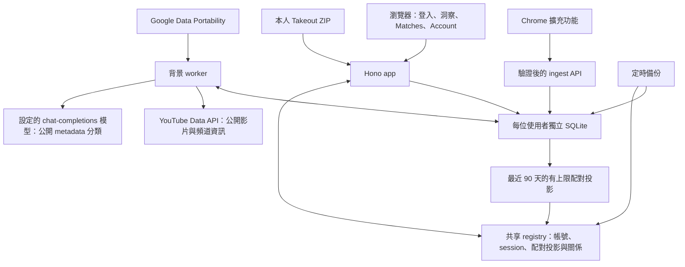

# urtube — 從觀看紀錄理解自己，找到有共同興趣的人

**正式網址：[urtube.observe.tw](https://urtube.observe.tw)** · [原始碼](https://github.com/skyhong2002/urtube.observe.tw) · [第三方來源與授權](THIRD_PARTY_NOTICES.md)

urtube 在使用者授權後，將 YouTube 觀看紀錄整理成私人興趣洞察，再以近期共同興趣協助探索同好。你可以先看懂自己的注意力流向，再決定是否參與配對；完整觀看歷史不會因為加入配對就向候選人公開。

[](https://urtube.observe.tw)

## 問題與目標

對於經常透過 YouTube 學習、追蹤創作者與探索興趣的人，自填幾個興趣標籤很難呈現最近真正關注的內容；多年觀看紀錄雖然包含這些線索，卻難以自行整理，也不適合整份拿來交友。

urtube 的目標是讓使用者在掌握揭露範圍的前提下，將既有紀錄轉成可理解、可檢視的個人興趣地圖。即使尚無其他使用者或符合條件的配對者，觀看時間、常看頻道、關鍵字與主題變化仍提供第一次匯入的價值。

**重要影響力（Great Impact）**在於降低理解自身數位生活與找到共同話題的門檻，同時減少為了認識同好而公開私人紀錄的需要。這是待驗證的產品效益；目前未公布使用者規模、留存率或交友成功率。後續可在使用者同意與最少資料蒐集原則下，評估首次洞察完成率、使用者能否辨認自己的近期興趣，以及雙向「想認識」的完成率。配對畫面的百分比是相似度指標，不是相識成功率。

## 核心功能

| 功能 | 使用者可以做什麼 |
| --- | --- |
| 授權匯入與進度 | Google 登入後，使用 Chrome 擴充功能或 Google Takeout ZIP 匯入紀錄，查看可持續更新的背景處理狀態。 |
| 私人興趣洞察 | 查看觀看時間、頻道與影片、公開 metadata 關鍵字，以及不同時間範圍的主題趨勢。 |
| 可檢視的 AI 分類 | AI 依公開影片 metadata 整理個人主題；新版分類提供證據、品質檢查與本人審閱／啟用／回復流程。 |
| 近期同好探索 | 以最近 90 天的共通主題與頻道聚合資料產生候選名單與 VS 比較；資料不足或沒有候選人時顯示對應狀態。 |
| 雙向同意與 Blend | 雙方選擇「想認識」後，可查看允許的共同影片、頻道與較完整統計；好友個人頁提供 Blend 比較。 |
| 資料控制 | 關閉配對、撤回關係、設定儀表板公開性，以及匯出或刪除自己的資料。 |

### 最短使用流程

1. 開啟正式站，選擇 **Sign up / sign in** 並使用自己的 Google 帳號；若服務暫停註冊，先從導覽列查看 **Example dashboard**。
2. 依引導設定 handle；安裝擴充功能同步，或在 **Account** 的 Takeout 匯入區上傳 ZIP。
3. 查看處理進度，再到私人儀表板確認洞察；公開影片資訊或模型尚未處理完時，結果可能不完整。
4. 依 onboarding 確認配對設定，進入 **Matches**，選擇候選人查看 VS；兩人都選擇「想認識」才解鎖較完整比較。
5. 在 **Account** 管理資料與配對。新註冊帳號的儀表板預設私人；目前配對開關預設開啟，與儀表板公開設定分開，請在確認步驟檢查自己的選擇。

沒有共用測試帳號。Example dashboard 顯示的是實例擁有者允許公開的頁面；本機合成示範則使用虛構資料，見下方安裝指南。

## 系統架構



前端由伺服器產生 HTML，搭配 CSS、原生 JavaScript 與 SVG 圖表。app 負責互動、登入與存取控制；ingest 接收擴充功能與匯入請求；worker 補齊公開 metadata、分類與配對投影。原始紀錄留在各使用者的 SQLite，候選查詢讀取共享 registry 中有上限的聚合投影。

AI 請求只包含公開影片中繼資料（public video metadata）：標題、頻道名稱、描述與 tags，不包含帳號、搜尋字串、觀看時間、觀看次數或播放進度。證據不足時標為 `Unknown`（無法判斷），本人可在分類審閱頁啟用通過品質檢查的候選版本，也可回復（rollback）先前版本。個人 AI 主題與跨人配對的共通分類分開管理。目前配對使用 `calibrated-v2`：分別計算共通主題與頻道向量的 cosine similarity，套用固定校準後平均可用維度，輸出 0–100 整數；主題覆蓋不足時僅使用頻道維度並標示暫定結果。細節見 [產品與分數說明](docs/pitch.md)及[配對實作](src/youtube/candidates.ts)。

雙向同意前，VS 只提供受限的分數、概括主題與活動節奏；同意後才增加共同內容與統計，仍不交換搜尋字串、精確觀看時間戳或完整私人儀表板。關閉配對或撤回後，每次讀取依當前權限判斷。

部署使用 Docker Compose 分開執行 app、ingest、worker 與 backup。依[目前部署紀錄](CUTOVER_RUNBOOK.md)，正式站透過 Cloudflare Tunnel 對外服務，Tunnel 設定不在 repository 內；自架可使用反向代理將 `/api/ingest/*` 導向 ingest，其餘路徑導向 app。

## 使用技術

| 類型 | 技術／服務 | 用途 |
| --- | --- | --- |
| AI 模型 | 可設定的 OpenAI-compatible chat-completions 服務 | 從公開 metadata 整理語意與個人主題；repository 不內含模型權重，實際模型名稱／版本待部署者補充。既有 Codex gateway 部署紀錄見 [AI gateway](docs/ai-gateway.md)。 |
| 前端 | Server-rendered HTML、CSS、原生 JavaScript、SVG | 直接提供洞察與互動圖表，支援繁中／英文介面。 |
| 後端 | TypeScript、Node.js、Hono、Zod | 共用 HTTP 架構、型別檢查與輸入驗證；`tsx` 執行 TypeScript。 |
| 資料庫 | Node.js `node:sqlite`、每人一份 SQLite、共享 registry | 將原始資料與配對投影分離，支援個人匯出與整體備份。 |
| 匯入與解析 | Chrome Extension Manifest V3、Cheerio、fflate | 擷取本人紀錄、解析 Takeout HTML／JSON 與 ZIP。 |
| 外部資料 | Google OAuth、YouTube Data API v3、Google Data Portability、analysis.tw | 身分驗證、公開 metadata、本人授權匯入與受治理頻道標籤。 |
| 維運 | Docker Compose、Cloudflare Tunnel；自架反向代理可用 Caddy | 分離服務與備份、對外 HTTPS 及路由。 |
| Sponsor 技術 | 待補 | 待團隊確認需列名的贊助技術及實際用途。 |

亮點在於把語意理解、資料隔離與可重現計分放在不同責任層：AI 協助解讀內容，版本化程式負責跨人比較，權限檢查決定每次可揭露的結果。語意 embedding 與興趣分群仍是後續工作，未列為本版已完成能力。

## 安裝與執行

以下指令適用於 macOS／Linux 的 shell。需要 Git、Node.js 與 npm；Docker 路徑另需 Docker Engine／Desktop 與 Compose plugin。Dockerfile 使用 `node:22-alpine`；原生執行需要支援 `node:sqlite` 的 Node.js（22.13 以上），本次驗證使用原生 Node.js 24.2.0／npm 11.3.0，以及 Docker 內 Node.js 22.23.2。

### 1. 取得專案與安裝依賴

```bash
git clone https://github.com/skyhong2002/urtube.observe.tw.git
cd urtube.observe.tw
npm ci
npm run check
```

`npm run check` 執行 TypeScript 檢查與測試。依賴確切版本由 `package-lock.json` 決定。

### 2. 先體驗不需憑證的合成示範

```bash
npm run demo:matching
```

終端會輸出 Alice 與 Bob 的本機登入連結，預設 `http://127.0.0.1:4317`。用兩個不同瀏覽器 profile 分別開啟，可操作候選、VS、雙向「想認識」與撤回。連結只供本機示範，請勿公開；Ctrl-C 關閉，重啟會重設示範資料。此模式使用暫存 SQLite 與人工建立的投影，不驗證 Google 登入、真實匯入或模型輸出。

### 3. 設定自己的本機實例

在新的 checkout 複製設定檔；已有 `.env` 時請直接編輯，勿覆蓋既有金鑰。

```bash
cp .env.example .env
node --input-type=module <<'JS'
import { readFileSync, writeFileSync, chmodSync } from 'node:fs';
import { randomBytes } from 'node:crypto';
let env = readFileSync('.env', 'utf8');
const values = {
  PUBLIC_BASE_URL: 'http://localhost:3000',
  OWNER_NAME: 'Local Example',
  OWNER_HANDLE: 'local-example',
  SIGNUP_ENABLED: 'true',
};
for (const key of ['INGEST_TOKEN', 'YOUTUBE_CAPTURE_TOKEN', 'YOUTUBE_PRIVATE_DATA_KEY']) {
  values[key] = randomBytes(48).toString('base64url');
}
for (const [key, value] of Object.entries(values)) {
  env = env.replace(new RegExp(`^${key}=.*$`, 'm'), `${key}=${value}`);
}
writeFileSync('.env', env, { mode: 0o600 });
chmodSync('.env', 0o600);
JS
```

這段只適用於首次建立實例；既有資料的加密金鑰不能重新產生。它不會把金鑰印到終端。`.env` 已被 Git 忽略。

| 設定 | 何時需要／如何設定 |
| --- | --- |
| `PUBLIC_BASE_URL` | 本機使用 `http://localhost:3000`；正式部署填自己的 HTTPS origin，用來建立 callback 與 cookie 設定。 |
| 三個安全金鑰 | 上方指令會建立；各至少 32 字元，服務共用同一份設定。 |
| `GOOGLE_LOGIN_CLIENT_ID`、`GOOGLE_LOGIN_CLIENT_SECRET` | 真實帳號登入必填。在 [Google Cloud Console](https://console.cloud.google.com/) 建立專案、設定 OAuth 同意畫面／測試使用者，再建立 Web application OAuth client；Authorized redirect URI 填 `http://localhost:3000/auth/google/callback`。登入使用 `openid email`。 |
| `YOUTUBE_API_KEY` | 補齊公開影片／頻道 metadata 時需要；在同一控制台啟用 YouTube Data API v3 並建立適用伺服器呼叫的 API key。沒有 metadata 會限制分類與配對。 |
| `AI_CLASSIFICATION_ENABLED`、`AI_BASE_URL`、`AI_API_KEY`、`AI_MODEL` | AI 分類需要全部設定；enabled 設為 `true`，base URL 指向服務的 `/v1` 根路徑，model 填該服務實際可用名稱。預設關閉。自架服務亦需符合程式要求的 API key 設定。 |
| `GOOGLE_DATA_PORTABILITY_CLIENT_ID`、`GOOGLE_DATA_PORTABILITY_CLIENT_SECRET` | 選用的定期匯入；callback 為 `<PUBLIC_BASE_URL>/api/ingest/youtube/oauth/callback`。需要 API 啟用、適用 scopes 與 Google 要求的驗證；現行實作僅供 instance owner 使用。 |
| `SIGNUP_ENABLED`、`MAX_USERS`、`MAX_USER_DATABASE_MB` | 範例預設關閉註冊、最多 25 人、每人 512 MiB；上方本機初始化開啟註冊。這些是容量設定，並非負載測試結果。 |
| `DATABASE_PATH`、`USERS_DATABASE_PATH` | 未設定時為 `./data/urtube.sqlite`、`./data/users.sqlite`，其他帳號資料在 `./data/users/`。各服務須從同一專案目錄啟動。 |
| `AI_TIMEOUT_MS`、`AI_CONCURRENCY` | 預設單次 60 秒、最多 4 個模型請求併發；依實際服務調整並留意用量。 |

完整設定見 [`.env.example`](.env.example)。Google 的設定步驟與條款見 [OAuth Web server 指南](https://developers.google.com/identity/protocols/oauth2/web-server)、[YouTube API 啟用指南](https://developers.google.com/youtube/v3/getting-started)及 [Data Portability 前置作業](https://developers.google.com/data-portability)。

### 4. 啟動 app、ingest 與 worker

在三個終端中，分別從專案根目錄執行：

```bash
# 終端一：網站
PORT=3000 node --env-file=.env --import tsx src/index.ts
```

```bash
# 終端二：擴充功能／API 匯入服務
PORT=3001 node --env-file=.env --import tsx src/ingest.ts
```

```bash
# 終端三：公開 metadata、分類與配對投影背景工作
node --env-file=.env --import tsx src/youtube-worker.ts
```

`--env-file` 明確載入設定；原始 npm scripts 不會自行讀取 `.env`。app 與 ingest 必須使用不同 port。開啟 [本機網站](http://localhost:3000)，用 Google 登入後，在 Account 上傳自己的 Takeout ZIP。取得 ZIP 時到 [Google Takeout](https://takeout.google.com/) 選擇 YouTube and YouTube Music 內的觀看歷史，匯出後保留 ZIP 結構。此瀏覽器匯入路徑直接使用 app，不需要將本機擴充功能改成其他網域。

正式版擴充功能只接受 `urtube.observe.tw`，不能直接連到 localhost。自訂網域的擴充功能仍需同步修改 manifest host permissions 與 endpoint 驗證並另行測試；目前 repository 沒有可直接重現的完整本機擴充功能指南。本機請使用 Account 的 Takeout 匯入。Google OAuth、真實帳號匯入、Data Portability 與實際模型呼叫仍需具備相應憑證後驗證；本次已實測合成匯入、儀表板、雙帳號示範入口與四服務啟動。

**資料可見性：**首次啟動建立的 instance owner 是公開 Example dashboard；`youtube:import` CLI 寫入該 owner archive。私人歷史應使用 Google 登入後的 Account 匯入，避免誤放進公開示範帳號。

```bash
curl -fsS http://localhost:3000/healthz
curl -fsS http://localhost:3001/healthz
# 額外確認 worker、備份及各帳號資料狀態；不完整時可回傳 503
curl -sS http://localhost:3000/readyz
```

沒有啟動備份或尚未完成外部服務設定時，`/readyz` 不一定成功；`/healthz` 成功只表示存活。需要本機定時備份時另開終端：

```bash
URTUBE_BACKUP_DIRECTORY=./backups node --env-file=.env --import tsx scripts/backup-worker.ts
```

### 5. Docker Compose

先完成 `.env` 設定。本機 Compose 的 app 位址改為 `http://localhost:18080`，並將 Google OAuth callback 一併改成此 origin；ingest 使用 `http://localhost:18081`。正式站則使用自己的 HTTPS origin。

```bash
docker compose config --quiet
docker compose up -d --build
docker compose ps
curl -fsS http://localhost:18080/healthz
curl -fsS http://localhost:18081/healthz
docker compose logs --tail=50 app ingest worker backup
# 停止服務，保留資料 volume
docker compose down
```

Compose 會啟動四個服務，資料存於 `urtube-data` volume，備份預設在宿主機 `./backups`。正式對外服務仍需反向代理／Tunnel 設定；`/api/ingest/*` 應導向 `18081`，其餘導向 `18080`。本機模型若跑在宿主機，容器端的 `AI_BASE_URL` 須使用容器可達位址；app／worker 已設定 `host.docker.internal` 映射。

### 故障排除與維運

| 現象 | 檢查方式 |
| --- | --- |
| 無法 Google 登入／redirect mismatch | 比對 `.env` 的 origin、Google Console callback 與瀏覽器實際網址；確認測試帳號、client ID／secret 與註冊設定。 |
| `EADDRINUSE` | app／ingest 分別使用 3000／3001；Compose 使用 18080／18081。先確認連接埠沒有其他服務。 |
| AI／metadata 沒進度 | 確認 worker 運作、API key、模型名稱、endpoint、配額與 timeout；依畫面的失敗／重試狀態排查。 |
| Takeout 被拒絕 | 使用包含觀看歷史的原始 ZIP，瀏覽器上傳上限 100 MiB；依錯誤訊息檢查格式與帳號儲存容量。 |
| 看不到配對人選 | 檢查配對開關、最近 90 天至少 200 次觀看與 14 個活躍日，以及是否有其他合格且開啟配對的帳號。 |
| readiness 503 | 查看 `/readyz` 的各項結果、worker heartbeat 與備份狀態，不只看網站是否能打開。 |

更多資料：[部署／備份與還原](CUTOVER_RUNBOOK.md)、[系統資料邊界](YOUTUBE_BOUNDARY.md)、[個人分類審閱](docs/personal-taxonomy-v2.md)、[關鍵字管線](docs/keyword-pipeline.md)、[頻道標籤政策](docs/channel-tag-policy.md)、[匿名參考母體](docs/reference-population.md)、[安全稽核紀錄](docs/security-audit.md)。

## 作品展示

- **正式作品：[https://urtube.observe.tw](https://urtube.observe.tw)**。
- **評選影片：待補**。
- 不登入可由首頁導覽開啟 Example dashboard；可重設的兩帳號合成示範使用 `npm run demo:matching`。
- 展示操作與證據整理見 [Demo runbook](docs/demo-runbook.md)。

## 限制與未來工作

- 觀看時間包含估計值；觀看某類內容不代表使用者的政治立場、人格或身分。頻道標籤只描述來源對內容的分類，且不代表整體 YouTube 覆蓋率。
- 配對受最近活動量、分類覆蓋與其他同意參與者數量限制；共通主題需要目前版本至少 80% 覆蓋，未達時依目前程式只使用頻道維度。
- Google 登入、公開 metadata、AI 分類與 Data Portability 需要外部服務設定；Data Portability 限 instance owner，模型 gateway 原始碼與正式 Tunnel 設定不在本 repository，僅 clone 無法重建這些外部服務。
- 目前沒有可公布的端到端延遲、每人模型成本或大規模負載結果；應以自己的資料量與供應商用量實測。長歷史的五年／五萬筆、16 GB 裝置實帳號驗收仍由 [#3](https://github.com/skyhong2002/urtube.observe.tw/issues/3) 追蹤。
- 後續語意標籤、embedding 快取、興趣分群與新配對方式由 [#44](https://github.com/skyhong2002/urtube.observe.tw/issues/44)、[#45](https://github.com/skyhong2002/urtube.observe.tw/issues/45)、[#46](https://github.com/skyhong2002/urtube.observe.tw/issues/46)、[#47](https://github.com/skyhong2002/urtube.observe.tw/issues/47) 追蹤；本版文件不將尚未合併工作列為已交付。
- 正式模型識別、外部資料的再利用授權與發布映像的完整元件盤點仍有待確認項目，詳見第三方聲明。

## 第三方服務、資料與素材

完整來源、確切套件版本、授權文字、外部條款與尚待確認項目集中於 [THIRD_PARTY_NOTICES.md](THIRD_PARTY_NOTICES.md)，包含：

- npm 直接／間接依賴及各平台選用套件，與可擷取的 CycloneDX SBOM。
- Google／YouTube、analysis.tw 頻道清單、Google／Gravatar 頭像與部署服務。
- 可設定 AI 服務的模型／資料來源揭露狀態，以及專案圖示、OG 圖片與合成示範資料的來源。

使用者提供自己的觀看歷史不會使該資料成為 MIT 開源內容；外部 API 可存取也不代表可自由再散布。請勿將 `.env`、API key、Token、私人 archive 或實帳號畫面放入 repository、issue 或展示素材。

## 團隊成員

| 姓名 | 分工 |
| --- | --- |
| 待補 | 待團隊提供公開姓名與分工。 |

## License

專案程式與文件採用 [MIT License](LICENSE)，著作權聲明為 `Copyright (c) 2026 urtube contributors`。第三方套件、服務、資料與素材依各自授權或條款處理，請一併閱讀 [第三方來源與授權聲明](THIRD_PARTY_NOTICES.md)。
