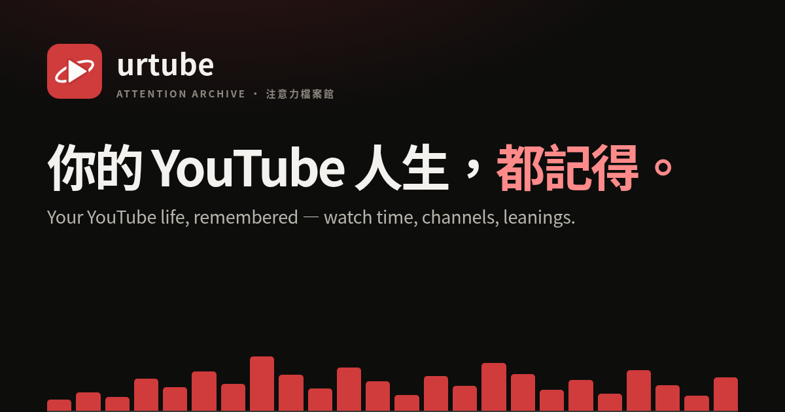
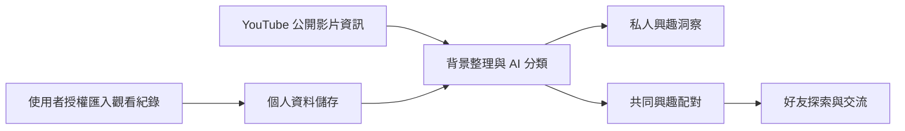

# urtube — 以真實行為資料找到長期同好的交友網站

**正式網址：[urtube.observe.tw](https://urtube.observe.tw)** · [原始碼](https://github.com/skyhong2002/urtube.observe.tw) · [第三方來源與授權](THIRD_PARTY_NOTICES.md)

urtube 是正在開發中的 **data-driven 交友網站**，以使用者授權的真實行為資料為基礎，協助人們找到長期具有共同興趣與喜好的朋友。目前從 YouTube 觀看紀錄出發，分析持續關注的主題、創作者與偏好變化，將這些線索轉化為同好探索與交流的起點。

[](https://urtube.observe.tw)

## 問題與目標

認識一個人之後，如何知道彼此有哪些能持續交流的共同興趣？對於希望透過共同喜好建立友誼的人，個人介紹與自填標籤提供了初步線索，而日常反覆觀看、學習與追蹤的內容，能進一步呈現投入的程度與興趣隨時間的變化。

urtube 希望以真實行為資料提升同好探索的準確度，找出長期具有共同興趣與喜好的族群，讓使用者更容易遇見有共同話題、值得持續認識的人。這是應用程式與網站的核心方向：從實際行為理解偏好，從共同偏好建立連結，再透過交流發展友誼。

日常累積的觀看紀錄，也保存了不同時間點的關注與探索。透過跨時間的興趣洞察，使用者可以回顧自己在不同年齡與人生階段接觸過的內容，重溫當時的經歷，理解喜好如何延續與改變。目前配對使用最近 90 天的共通主題與頻道資料；私人興趣地圖協助使用者理解配對依據，長期興趣的穩定性則是後續配對方法的發展重點。

在 AI 與 Agent 日益融入生活的時代，urtube 希望讓這些真實行為資料成為認識彼此的起點：從回顧自己的經歷，到找到志同道合的夥伴，拓展原有生活圈之外的社交機會，建立能持續交流的友誼。後續將透過使用者對共同興趣推薦的回饋、好友邀請接受率，以及經同意回報的持續交流情形，評估配對品質與長期連結的價值。

## 核心功能

| 功能 | 使用者可以做什麼 |
| --- | --- |
| 授權匯入與進度 | Google 登入後，使用 Chrome 擴充功能或 Google Takeout ZIP 匯入紀錄，查看可持續更新的背景處理狀態。 |
| 私人興趣洞察 | 查看觀看時間、頻道與影片、影片內容關鍵字，以及不同時間範圍的主題趨勢，理解自己的偏好與配對依據。 |
| 可檢視的 AI 分類 | AI 協助整理觀看內容中的興趣主題，使用者可查看分類依據、確認結果與復原先前的分類。 |
| 近期同好探索 | 以最近 90 天的共同主題與頻道喜好推薦同好並提供比較；資料不足或沒有候選人時顯示對應狀態。 |
| 好友與 Blend | 私人帳號接受好友邀請後，雙方可查看總覽、洞察與 Blend；登入使用者也可直接與公開帳號進行 Blend。 |
| 資料控制 | 關閉配對、撤回關係、設定儀表板公開性，以及匯出或刪除自己的資料。 |

總覽（Overview）呈現常看的主題、頻道與興趣變化，搭配可播放的排行動畫，幫助使用者回顧不同時期的關注。本人也可在頁面底部查看最近觀看紀錄。

### 最短使用流程

1. 開啟正式站，選擇 **Sign up / sign in** 並使用自己的 Google 帳號；若服務暫停註冊，先從導覽列查看 **Example dashboard**。
2. 依引導設定使用者名稱；安裝擴充功能同步，或在 **Account** 的 Takeout 匯入區上傳 ZIP。
3. 查看處理進度，再到私人儀表板確認洞察；公開影片資訊或模型尚未處理完時，結果可能不完整。
4. 依首次使用引導確認配對設定，進入 **Matches**。私人帳號先選擇「加好友」，對方接受後可看總覽、洞察與 Blend；公開帳號可直接進行 Blend。
5. 在 **Account** 管理資料與配對。新註冊帳號的儀表板預設私人；目前配對開關預設開啟，與儀表板公開設定分開，請在確認步驟檢查自己的選擇。

請使用自己的 Google 帳號登入。Example dashboard 顯示的是實例擁有者允許公開的頁面；本機合成示範則使用虛構資料，見下方安裝指南。

## 系統架構



網站負責登入、資料匯入與好友互動；背景服務整理影片資訊與興趣，讓使用者能在介面上查看洞察與探索同好。每位使用者的原始紀錄分開儲存，配對使用整理後的共同興趣資訊。

AI 分類使用公開影片資訊，例如標題、頻道名稱與描述；搜尋紀錄與觀看時間保留在個人資料中。資訊不足時顯示「無法判斷」，使用者可檢視分類依據並復原先前結果。

私人帳號接受好友邀請後，雙方可看總覽、洞察與 Blend。公開帳號的總覽與洞察可供訪客閱讀，登入使用者可直接進行 Blend；詳細觀看紀錄與回顧由本人管理。配對參與、好友關係與頁面公開性可在帳號設定中調整。

## 使用技術

| 類型 | 技術／服務 | 用途 |
| --- | --- | --- |
| AI 模型 | 可設定的 AI 服務，實際模型待補 | 從影片資訊整理興趣主題，協助理解使用者長期關注的內容。 |
| 前端 | HTML、CSS、JavaScript、SVG | 呈現興趣洞察、時間趨勢、好友頁面與互動圖表。 |
| 後端 | TypeScript、Node.js、Hono | 處理帳號、匯入、背景分析與好友互動。 |
| 資料庫 | SQLite | 分開保存個人紀錄，支援匯出與備份。 |
| 資料來源 | YouTube、Google Takeout、Chrome 擴充功能 | 匯入本人授權的觀看紀錄與取得公開影片資訊。 |
| 部署 | Docker Compose、Cloudflare Tunnel | 執行網站與背景服務，提供對外連線。 |
| Sponsor 技術 | 待補 | 待團隊確認需列名的贊助技術及實際用途。 |

AI 協助整理興趣，行為資料支持同好探索，時間趨勢則讓使用者看見喜好的持續與改變。這些能力共同支援從理解自己、發現共同話題，到建立好友關係的交友體驗。

## 安裝與執行

需要 Git、Node.js 22.13 以上與 npm。以下指令適用於 macOS／Linux；完整自架方式見下方展開說明。

### 1. 取得專案與安裝依賴

```bash
git clone https://github.com/skyhong2002/urtube.observe.tw.git
cd urtube.observe.tw
npm ci
npm run check
```

`npm run check` 執行 TypeScript 檢查與測試。依賴確切版本由 `package-lock.json` 決定。

### 2. 先體驗不需憑證的合成示範

```bash
npm run demo:matching
```

終端會輸出 Alice 與 Bob 的本機登入連結，預設 `http://127.0.0.1:4317`。用兩個不同瀏覽器 profile 分別開啟，可操作候選、好友邀請、Blend 與撤回。連結只供本機示範，請勿公開；Ctrl-C 關閉，重啟會重設示範資料。此模式使用合成資料體驗配對流程；使用自己的帳號與觀看紀錄，請依下方指南設定。

<details>
<summary>完整自架指南：帳號設定、資料匯入、服務啟動與部署</summary>

### 3. 設定自己的本機實例

在新的 checkout 複製設定檔；已有 `.env` 時請直接編輯，勿覆蓋既有金鑰。

```bash
cp .env.example .env
node --input-type=module <<'JS'
import { readFileSync, writeFileSync, chmodSync } from 'node:fs';
import { randomBytes } from 'node:crypto';
let env = readFileSync('.env', 'utf8');
const values = {
  PUBLIC_BASE_URL: 'http://localhost:3000',
  OWNER_NAME: 'Local Example',
  OWNER_HANDLE: 'local-example',
  SIGNUP_ENABLED: 'true',
};
for (const key of ['INGEST_TOKEN', 'YOUTUBE_CAPTURE_TOKEN', 'YOUTUBE_PRIVATE_DATA_KEY']) {
  values[key] = randomBytes(48).toString('base64url');
}
for (const [key, value] of Object.entries(values)) {
  env = env.replace(new RegExp(`^${key}=.*$`, 'm'), `${key}=${value}`);
}
writeFileSync('.env', env, { mode: 0o600 });
chmodSync('.env', 0o600);
JS
```

這段只適用於首次建立實例；既有資料的加密金鑰不能重新產生。它不會把金鑰印到終端。`.env` 已被 Git 忽略。

| 設定 | 何時需要／如何設定 |
| --- | --- |
| `PUBLIC_BASE_URL` | 本機使用 `http://localhost:3000`；正式部署填自己的 HTTPS origin，用來建立 callback 與 cookie 設定。 |
| 三個安全金鑰 | 上方指令會建立；各至少 32 字元，服務共用同一份設定。 |
| `GOOGLE_LOGIN_CLIENT_ID`、`GOOGLE_LOGIN_CLIENT_SECRET` | 真實帳號登入必填。在 [Google Cloud Console](https://console.cloud.google.com/) 建立專案、設定 OAuth 同意畫面／測試使用者，再建立 Web application OAuth client；Authorized redirect URI 填 `http://localhost:3000/auth/google/callback`。登入使用 `openid email`。 |
| `YOUTUBE_API_KEY` | 補齊公開影片／頻道 metadata 時需要；在同一控制台啟用 YouTube Data API v3 並建立適用伺服器呼叫的 API key。沒有 metadata 會限制分類與配對。 |
| `AI_CLASSIFICATION_ENABLED`、`AI_BASE_URL`、`AI_API_KEY`、`AI_MODEL` | AI 分類需要全部設定；enabled 設為 `true`，base URL 指向服務的 `/v1` 根路徑，model 填該服務實際可用名稱。預設關閉。自架服務亦需符合程式要求的 API key 設定。 |
| `GOOGLE_DATA_PORTABILITY_CLIENT_ID`、`GOOGLE_DATA_PORTABILITY_CLIENT_SECRET` | 選用的定期匯入；callback 為 `<PUBLIC_BASE_URL>/api/ingest/youtube/oauth/callback`。需要 API 啟用、適用 scopes 與 Google 要求的驗證；現行實作僅供 instance owner 使用。 |
| `SIGNUP_ENABLED`、`MAX_USERS`、`MAX_USER_DATABASE_MB` | 範例預設關閉註冊、最多 25 人、每人 512 MiB；上方本機初始化開啟註冊。可依實例容量調整。 |
| `DATABASE_PATH`、`USERS_DATABASE_PATH` | 未設定時為 `./data/urtube.sqlite`、`./data/users.sqlite`，其他帳號資料在 `./data/users/`。各服務須從同一專案目錄啟動。 |
| `AI_TIMEOUT_MS`、`AI_CONCURRENCY` | 預設單次 60 秒、最多 4 個模型請求併發；依實際服務調整並留意用量。 |

完整設定見 [`.env.example`](.env.example)。Google 的設定步驟與條款見 [OAuth Web server 指南](https://developers.google.com/identity/protocols/oauth2/web-server)、[YouTube API 啟用指南](https://developers.google.com/youtube/v3/getting-started)及 [Data Portability 前置作業](https://developers.google.com/data-portability)。

### 4. 啟動 app、ingest 與 worker

在三個終端中，分別從專案根目錄執行：

```bash
# 終端一：網站
PORT=3000 node --env-file=.env --import tsx src/index.ts
```

```bash
# 終端二：擴充功能／API 匯入服務
PORT=3001 node --env-file=.env --import tsx src/ingest.ts
```

```bash
# 終端三：影片資訊、興趣整理與配對背景工作
node --env-file=.env --import tsx src/youtube-worker.ts
```

`--env-file` 明確載入設定；原始 npm scripts 不會自行讀取 `.env`。app 與 ingest 必須使用不同 port。開啟 [本機網站](http://localhost:3000)，用 Google 登入後，在 Account 上傳自己的 Takeout ZIP。取得 ZIP 時到 [Google Takeout](https://takeout.google.com/) 選擇 YouTube and YouTube Music 內的觀看歷史，匯出後保留 ZIP 結構。此瀏覽器匯入路徑直接使用 app，不需要將本機擴充功能改成其他網域。

正式版擴充功能只接受 `urtube.observe.tw`，不能直接連到 localhost。自訂網域的擴充功能仍需同步修改 manifest host permissions 與 endpoint 驗證並另行測試；目前 repository 沒有可直接重現的完整本機擴充功能指南。本機請使用 Account 的 Takeout 匯入。Google OAuth、真實帳號匯入、Data Portability 與實際模型呼叫仍需具備相應憑證後驗證；本次已實測合成匯入、儀表板、雙帳號示範入口與四服務啟動。

**資料可見性：**首次啟動建立的 instance owner 是公開 Example dashboard；`youtube:import` CLI 寫入該 owner archive。私人歷史應使用 Google 登入後的 Account 匯入，避免誤放進公開示範帳號。

```bash
curl -fsS http://localhost:3000/healthz
curl -fsS http://localhost:3001/healthz
# 額外確認 worker、備份及各帳號資料狀態；不完整時可回傳 503
curl -sS http://localhost:3000/readyz
```

沒有啟動備份或尚未完成外部服務設定時，`/readyz` 不一定成功；`/healthz` 成功只表示存活。需要本機定時備份時另開終端：

```bash
URTUBE_BACKUP_DIRECTORY=./backups node --env-file=.env --import tsx scripts/backup-worker.ts
```

### 5. Docker Compose

先完成 `.env` 設定。本機 Compose 的 app 位址改為 `http://localhost:18080`，並將 Google OAuth callback 一併改成此 origin；ingest 使用 `http://localhost:18081`。正式站則使用自己的 HTTPS origin。

```bash
docker compose config --quiet
docker compose up -d --build
docker compose ps
curl -fsS http://localhost:18080/healthz
curl -fsS http://localhost:18081/healthz
docker compose logs --tail=50 app ingest worker backup
# 停止服務，保留資料 volume
docker compose down
```

Compose 會啟動四個服務，資料存於 `urtube-data` volume，備份預設在宿主機 `./backups`。正式對外服務仍需反向代理／Tunnel 設定；`/api/ingest/*` 應導向 `18081`，其餘導向 `18080`。本機模型若跑在宿主機，容器端的 `AI_BASE_URL` 須使用容器可達位址；app／worker 已設定 `host.docker.internal` 映射。

### 故障排除與維運

| 現象 | 檢查方式 |
| --- | --- |
| 無法 Google 登入／redirect mismatch | 比對 `.env` 的 origin、Google Console callback 與瀏覽器實際網址；確認測試帳號、client ID／secret 與註冊設定。 |
| `EADDRINUSE` | app／ingest 分別使用 3000／3001；Compose 使用 18080／18081。先確認連接埠沒有其他服務。 |
| AI／metadata 沒進度 | 確認 worker 運作、API key、模型名稱、endpoint、配額與 timeout；依畫面的失敗／重試狀態排查。 |
| Takeout 被拒絕 | 使用包含觀看歷史的原始 ZIP，瀏覽器上傳上限 100 MiB；依錯誤訊息檢查格式與帳號儲存容量。 |
| 看不到配對人選 | 檢查配對開關、匯入與處理進度，以及近期觀看資料是否充足；公開帳號可直接進行 Blend。 |
| readiness 503 | 查看 `/readyz` 的各項結果、worker heartbeat 與備份狀態，不只看網站是否能打開。 |

</details>

進一步設定見[部署與備份指南](CUTOVER_RUNBOOK.md)、[AI 服務設定](docs/ai-gateway.md)及[資料使用說明](YOUTUBE_BOUNDARY.md)。

## 作品展示

- **正式作品：[https://urtube.observe.tw](https://urtube.observe.tw)**。
- **評選影片：待補**。
- 不登入可由首頁導覽開啟 Example dashboard；可重設的兩帳號合成示範使用 `npm run demo:matching`。
- 展示操作與證據整理見 [Demo runbook](docs/demo-runbook.md)。

## 限制與未來工作

- 洞察品質取決於匯入紀錄的完整程度，以及影片資訊的可取得性；觀看時間包含估計值。
- 目前配對著重最近 90 天的興趣。資料不足或合適成員較少時，需要更多紀錄與參與者才能提供有用的推薦。
- Google 登入、影片資訊與 AI 分類需要外部服務設定。大量歷史資料的處理時間、成本與使用體驗仍待進一步實測。
- 後續將加強共同興趣的理解與呈現，探索長期喜好的穩定性，並透過使用者回饋改善配對品質。
- 團隊資訊、評選影片及部分第三方來源與授權資料仍待補充，詳細狀態見下方連結。

## 第三方服務、資料與素材

套件、AI 服務、Google／YouTube 資料、頻道標籤、頭像與專案素材的來源及授權，集中於 [第三方來源與授權聲明](THIRD_PARTY_NOTICES.md)。

使用者觀看歷史依本人授權使用，公開展示請使用合成資料。

## 團隊成員

| 姓名 | 分工 |
| --- | --- |
| 待補 | 待團隊提供公開姓名與分工。 |

## License

專案程式與文件採用 [MIT License](LICENSE)，著作權聲明為 `Copyright (c) 2026 urtube contributors`。第三方套件、服務、資料與素材依各自授權或條款處理，請一併閱讀 [第三方來源與授權聲明](THIRD_PARTY_NOTICES.md)。
