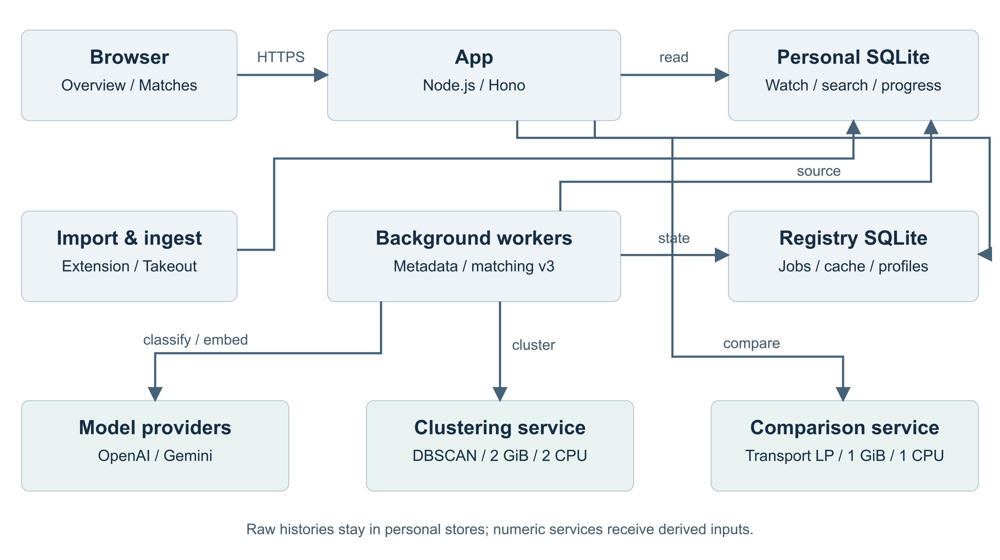
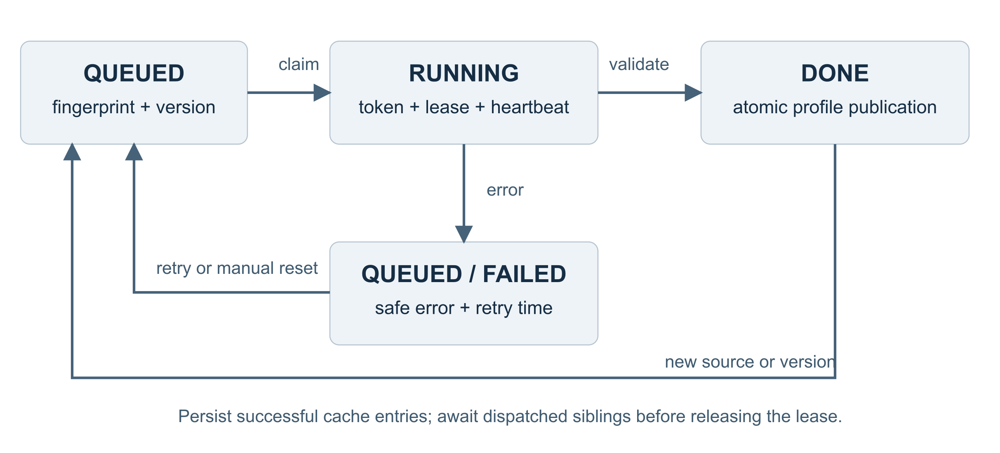

# URTube 技術文件

## 以觀看歷史建立可解釋的興趣分布與同好探索系統

編製團隊　urtube contributors

文件版本　1.0　　編製日期　2026 年 9 月 6 日

程式基準　85b5cec53ac703d0f790257dd658aaaa34d9eb75

作品網站　https://urtube.observe.tw

開源專案　https://github.com/skyhong2002/urtube.observe.tw

### 技術摘要

URTube 將使用者授權匯入的 YouTube 觀看歷史，轉換為個人洞察、興趣分布與可操作的同好探索。系統整合事件去重、觀看時間推估、公開 metadata 補齊、語言模型多標籤分類、語意向量、加權密度分群與最佳傳輸配對，並以版本化資料、可恢復工作佇列及逐次授權，維持不同處理階段的資料一致性。

本系統的主要技術貢獻，是將「看過相同主題」進一步表示為「在多個語意群之間如何分配興趣」。配對分數由數值演算法計算，推薦依據由實際運輸對應與權重構成；語言模型負責公開內容的語意判讀，不直接產生兩人的相似度或交友成功機率。

文件以目前程式實作為準，涵蓋架構、資料流程、AI 使用方式、核心數學模型、可靠性、授權、負載分析與可重現驗證。100 人、每人 20,000 部影片是容量分析情境；本文將已完成實作、隔離測試與後續容量驗收分別標示。

### 評分面向與文件證據

| 評分面向 | 權重 | 本文件提供的證據 |
| --- | --- | --- |
| 問題定義與影響力 | 35% | 使用者問題、需求與可衡量成效，第 1 節 |
| 技術實作 | 30% | 架構與 AI 適切性、技術難度、完成度與穩定性，第 2 至 11 節 |
| 成果展示 | 20% | 可重播的產品流程與演算法案例，第 6、12 節 |
| 開源品質 | 15% | 程式定位、依賴鎖定、CI、授權與重現方式，第 11 至 13 節 |

評分依 Round 1 書審標準；技術實作面向包含「架構與 AI 應用是否適切」及「技術難度、完成度與穩定性」。

<!-- page -->

## 1 問題定義與系統需求

### 1 1 從大量紀錄建立可理解的興趣表示

累積數萬部影片後，單純的觀看清單難以回答使用者長期關注哪些主題、近期偏好如何改變，以及與另一個人究竟有哪些共同興趣。直接計算共同影片也容易受到影片熱門程度與資料稀疏性影響：兩人可能觀看不同影片，卻關注相近的球類運動、教育內容或音樂風格。

URTube 的目標是讓使用者先理解自己的內容消費，再以明確的資料揭露規則探索同好。觀看行為只用來描述內容偏好，不推論使用者的政治立場、人格、健康或其他身分屬性。產品效果應以洞察可理解性、共同興趣的相關性及使用者自主控制衡量，不能以相似度分數替代社交成效。

### 1 2 功能與品質需求

| 需求 | 系統回應 | 可檢查條件 |
| --- | --- | --- |
| 累積歷史可持續匯入 | Chrome 擴充功能與 Takeout 匯入、事件去重及 metadata 回填 | 重複匯入不重複增加同一事件 |
| 個人洞察可追溯 | Overview、Insights、時間趨勢與分類資料 | 估計觀看時間與實際量測有區別 |
| 相似內容可跨字面比較 | tag embedding 與加權語意分群 | 相近向量可形成共同語意群 |
| 興趣交集不誇大整體契合 | 帶邊際約束的最佳傳輸 | 小交集不能無限制重複貢獻 |
| 模型失敗不破壞已完成工作 | 成功快取、租約、部分成功保存、退避重試 | 中斷後續接；過期工作不能覆蓋新結果 |
| 資料揭露可撤回 | 帳號、類別、公開性與好友關係逐次檢查 | 非同步計算期間撤回仍即時生效 |

### 1 3 分析範圍與成果邊界

目前產品包含近期整體合拍度與 v3 主題合拍度兩條表示路徑，整合於同一個 Matches 入口；兩者的輸入、資料資格與分數語意不同。本文保留此區分，不將它們描述成單一混合分數。

本次沒有進行真人配對成效研究，也沒有取得人工標註的完整語意相似度資料集。分類品質、門檻校準與社交效果仍需另外驗證。技術測試驗證資料契約、計算性質、失敗處理與授權邊界。[1][2]

<!-- page -->

## 2 系統架構與服務分工

圖 1　實作架構將個人原始紀錄、背景語意處理與線上比較分開；分群與比較服務接收數值表示，不掛載個人資料庫。

| 層級 | 元件與技術 | 責任與設計理由 |
| --- | --- | --- |
| 互動層 | HTML、CSS、JavaScript、SVG | 呈現洞察、處理狀態、具名成員與好友操作 |
| 應用層 | TypeScript、Node.js、Hono | Google 登入、請求驗證、聚合讀取、配對與授權 |
| 匯入層 | ingest service、extension、Takeout parser | 將多來源輸入正規化為事件及影片資料 |
| 資料層 | 個人 SQLite 與 registry SQLite | 個人歷史分庫；帳號、關係、作業與派生表示集中管理 |
| 背景層 | metadata worker、matching v3 worker | metadata、分類、embedding、工作恢復與 profile 建立 |
| AI 層 | OpenAI 分類、Gemini embedding | 分別完成語意標籤判讀與可比較的向量表示 |
| 數值層 | Python、NumPy、scikit-learn、SciPy | 加權 DBSCAN 與最佳傳輸，分群／比較分開執行 |

Docker Compose 定義服務邊界，對外入口由既有代理／Tunnel 提供。分群容器與比較容器分離，避免長時間分群占住唯一的比較服務；它們仍會競爭宿主機資源，並不等於具備自動水平擴展。SQLite 分庫有利於每帳號隔離與生命週期管理，但應用程序及管理者仍可存取多個資料庫，不能視為作業系統層的強隔離。[3]

<!-- page -->

## 3 資料模型與聚合流程

### 3 1 正規化事件與來源精度

匯入流程保留活動、影片、頻道、觀看事件與進度資料的不同角色。影片 ID 識別內容，事件識別某一次觀看；因此同一影片可以有多次事件。對來源只提供日期的資料，保留 day precision；取得較精確事件時，尋找同 identity、同台北日期的 placeholder，以避免把精度提升誤當成新增觀看。

來源 identity 依可用資料選用影片 ID、有效 URL 或原始標題。匯入使用 transaction 與去重集合，降低重送造成的重複資料；交易性寫入並不消除逐列查詢成本，相關索引風險於第 10 節量化。[4]

### 3 2 觀看時間推估與可重用中間表

系統將觀看與搜尋活動放入時間軸，透過 SQL window function 的 LEAD 尋找下一筆活動，並結合實際量測秒數、鄰近量測、事件精度、影片長度及播放進度，產生推估觀看秒數。不同資料來源有不同可信度，估計值不能當成精確的播放紀錄。

為避免 Dashboard、頻道與 Crystal 各自重做相同時間軸推估，Repository 建立每連線的 TEMP 推估事件表與索引。資料 revision 或時效改變時重新驗證／建立，後續聚合可共用此中間結果。此物化中間表可供目前的多個查詢重用；按日增量統計及 dirty-user 輪詢則列為後續改善。[4][5]

### 3 3 三種表示的不同用途

| 表示 | 主要粒度 | 用途與邊界 |
| --- | --- | --- |
| 個人歷史與洞察 | 事件、時間、影片、頻道、個人分類 | 支援本人回顧與聚合；細節受頁面授權保護 |
| 近期整體配對表示 | 最近 90 天的主題與頻道聚合 | 提供整體合拍度及既有 Blend 流程 |
| v3 興趣分布 | 每 genre 的語意群中心、質量、代表 tags | 提供所選主題的分布比較；權重以不同影片支援數計 |

v3 先取最近觀看的不同影片，再依影片 ID 固定排序並建立 fingerprint。預設 backfill 上限為 2,000 部；若要使每人的 20,000 部都參與 v3，需確認有效設定與資源。個人歷史保留量與投入 v3 的影片數是不同概念。[2][4]

<!-- page -->

## 4 AI 應用與資料契約

### 4 1 語言模型與向量模型分工

v3 使用 OpenAI gpt-5.6-luna、low reasoning effort，將影片標題與原始 tags 分到固定內容 genres。模型回應經 Zod 檢查欄位、類別列舉值與批次筆數；不合法的單筆結果保留為失敗，已成功的同批結果仍可快取。這是應用層契約驗證，不將提示內的 JSON schema 宣稱為供應商保證正確的結構化輸出。[6]

內容類別為 Politic、Music、Sport、Education、Video gaming、Streaming、News、Podcast；影片可屬於多類。第九類 channel type 另依公開頻道名稱與描述判斷經營類型，不加入內容 tag 分群。

| 階段 | 傳入外部服務的內容 | 回傳與檢查 |
| --- | --- | --- |
| 影片分類 | 公開標題與完整正規化原始 tags | genres 陣列；不生成 tags 或配對理由 |
| 語意 embedding | 單個正規化 tag 文字，批次最多 64 個 | 預設 768 維；維度、有限值與非零長度檢查 |
| 頻道類型 | 公開頻道名稱與描述 | 五種經營類型的子集合及證據可用狀態 |

搜尋詞、觀看時間戳、觀看次數、播放進度與使用者身分不屬於上述模型 payload。公開 metadata 本身仍視為不可信輸入，提示要求模型將其當作資料；本地列舉驗證可限制輸出形式，但不能取代分類內容的品質評估。[6]

### 4 2 原始 tags 與缺資料語意

新處理影片只產生 genres，原始 tags 進入每個適用 genre。沒有 tags 時，模型仍可依標題判斷類別，但系統不補造 tags；有 genre 卻沒有可用語意點，會影響該類別的資料充分性。過往已完成的快取保留來源標記；既有生成標籤與新處理的原始標籤仍可辨識來源。

Gemini 的 task 設為 SEMANTIC_SIMILARITY，向量回傳後正規化成單位長度。文字採 NFKC、空白整理、移除前導井號及小寫化，以降低字面差異造成的重複鍵。標題／描述中的 hashtags 亦可進入來源 tags。[2][6][7]

### 4 3 技術適切性

LLM 適合處理語意不一致與多標籤判讀；embedding 適合比較不同文字表達的接近程度；數值分群與最佳傳輸則讓權重、門檻及分數可重現。這種分工使推薦理由可以回到具體群、權重與分數貢獻，而非依賴另一段自由生成文字。

<!-- page -->

## 5 加權密度分群與興趣分布

### 5 1 以不同影片支援數建立權重

令 Vᵤ 為使用者 u 納入的不同影片集合，Aᵥ 為影片被指派的 genres，Tagsᵥ 為該影片的 tags。tag t 在 genre g 的質量定義為：

$$w_{u,g,t}=\sum_{v\in V_u}\mathbf{1}[g\in A_v]\,\mathbf{1}[t\in Tags_v]$$

每部影片對同一 tag 最多貢獻一次。權重表示跨影片支援度，不是重看次數或觀看時間；一部影片可以支援多個 tags，也可以出現在多個 genres，因此 tag 質量不是互斥影片比例。

### 5 2 加權 DBSCAN

單位向量間使用 cosine distance。預設 eps 為 0.2、minSamples 為 5；sample_weight 使用前述影片支援數。加權鄰域達到密度門檻的點形成核心點，相連的高密度區域形成群，孤立低支援點可成為 noise。[8]

$$d_{\cos}(x_i,x_j)=1-x_i^{\mathsf T}x_j,\qquad \sum_{j:d_{\cos}(x_i,x_j)\le\varepsilon}w_j\ge m$$

此模型可保留多個興趣中心，不需預先指定使用者應該有幾個興趣。它也使重複出現在不同影片中的單一 tag 能提供足夠密度；但結果仍受 embedding、eps、sample weight 與資料分布影響。

### 5 3 群中心與保留覆蓋

對群 C 計算加權平均後再正規化，並以群質量建立分布：

$$\mu_C=\frac{\sum_{t\in C}w_t x_t}{\left\|\sum_{t\in C}w_t x_t\right\|_2},\qquad p_C=\frac{\sum_{t\in C}w_t}{\sum_{D\in\mathcal R}\sum_{t\in D}w_t}$$

群質量低於總 tag 質量 5% 的群被排除，其餘最多保留十群，構成集合 R；每群保留五個代表 tags。retainedCoverage 另記錄保留質量相對於全部 tag 質量的比例，避免重新正規化後掩蓋資料流失。若已有點但覆蓋低於 50%，結果標記為資料不足／暫定，不能把剩下的小群視為完整興趣。[2][8]

<!-- page -->

## 6 最佳傳輸配對與可核對解釋

### 6 1 相似度 kernel 與運輸問題

令兩位使用者在某一 genre 的保留群分布為 p 與 q，群中心為 μ 與 ν。先以預設門檻 τ＝0.7 將 cosine similarity 映射到零至一：

$$k_{ij}=\operatorname{clip}\!\left(\frac{\mu_i^{\mathsf T}\nu_j-\tau}{1-\tau},0,1\right)$$

接著求解平衡最佳傳輸。πᵢⱼ 表示從左側群 i 配到右側群 j 的質量，每一側的群權重都必須守恆：

$$S_g=\max_{\pi\ge0}\sum_{i,j}\pi_{ij}k_{ij}\quad\text{s.t.}\quad\sum_j\pi_{ij}=p_i,\ \sum_i\pi_{ij}=q_j$$

實作以 SciPy linprog 與 HiGHS 最小化運輸成本 1－k，與上式等價。最多十群對十群，因此最多 100 個變數、20 列等式約束。HiGHS 自動選擇求解方法，本文不宣稱其固定為某個三次複雜度。[8][9]

### 6 2 小交集不應代表整體完全相同

固定向量測試中，A 的球類質量為 10、拳擊為 9；B 的球類質量 4 成為 noise，拳擊為 100。A 有兩群，B 保留拳擊一群。兩人雖然共享拳擊，但最多只有 A 的拳擊質量能以相似度一運輸，所得分數為 9／19，約 47.37%，而非 100%。B 的保留覆蓋仍為 100／104，另行呈現。[10]

### 6 3 多類別分數與解釋

所選 genres 等權平均。已處理且確定為空的類別給零；缺少可計算資料的類別使總分不可用，不重新縮小分母來提高分數。未完成掃描、低覆蓋或仍有處理工作的快照保留 provisional 狀態。[2]

$$S=\frac{1}{|\mathcal G|}\sum_{g\in\mathcal G}S_g\qquad\text{when all selected genres are computable}$$

說明取自運輸解中實際貢獻最大的群對，呈現代表 tags、雙方群占比與分數貢獻。解釋與分數使用同一輪廓快照；不另外呼叫 LLM 生成推薦理由。channel type 則使用五維 one-hot 類型分布，不經 tag DBSCAN，其分數等價於直方圖交集。[2][8]

<!-- page -->

## 7 配對整合與 API 契約

### 7 1 兩種分數保持不同語意

| 項目 | 整體合拍度 | v3 主題合拍度 |
| --- | --- | --- |
| 主要資料 | 最近 90 天的 canonical 主題及頻道聚合 | 納入來源影片的 genre 語意群分布 |
| 比較方法 | 主題／頻道 cosine 與固定校準曲線 | 每類最佳傳輸，所選類別等權平均 |
| 資料不足 | 依既有資料資格與可用維度處理 | 缺少所選類別資料時總分不可用 |
| 使用位置 | 成員清單與既有比較流程 | Matches 中的我的主題與主題結果 |

整體合拍度使用固定校準參數：主題 cosine 以線性區間調整，頻道 cosine 以指數曲線調整，避免兩種稀疏度不同的向量直接共用尺度。既有配對資格包含至少 200 筆近期觀看、14 個活動日；主題維度另檢查分類覆蓋。此路徑與 v3 的分數不混合，避免同一百分比具有模糊定義。[1]

### 7 2 線上請求與回應狀態

正式入口為 /matches。啟用 v3 時，同頁保留具名成員、頭像、Profile、好友邀請與 Blend；沒有可計算分數以「—」表示，不製造假分數。/matching-v3 轉向整合入口的主題檢視。[2]

POST /api/matching-v3/match 驗證所選 genres 與使用者目前同意，載入相同演算法版本的 profile，逐候選比較，再重新檢查帳號、session、類別同意及 profile 時間。每個使用者同一時間已有配對請求時回傳 matching_in_progress；profile 未就緒則回傳 profile_pending。可計算與可揭露是兩個不同判斷。[2]

### 7 3 行為一致性

公開帳號可依正式產品規則直接 Blend；好友可查看 Overview 與 Insights；History 與 Recap 仍需要本人或有效 dashboard key。v3 類別選擇控制主題配對揭露，不等於授予所有私人頁面的存取權，也不要求公開 Blend 等待 v3 profile 完成。

介面將整體分數、主題分數及暫定狀態分別標示。這使既有探索體驗與更細緻的分布模型能共存，且可逐步驗證新模型，而不讓使用者在兩個互不相通的入口重複操作。

<!-- page -->

## 8 非同步工作排程與一致性

### 8 1 租約與原子發布

每帳號工作保存 fingerprint、演算法版本、狀態、租約 token、租約期限、重試次數與時間。原子 UPDATE RETURNING 領取 queued 或過期的 running 工作，取得 180 秒租約；處理期間更新心跳。這提供可恢復的工作領取，不將外部 API 請求宣稱為 exactly once。[11]

工作提交前重新驗證使用者與來源；發布時以 registry transaction 檢查目前工作的 fingerprint、演算法版本與租約 token，再一起保存 profile 與 done 狀態。若來源更新使舊 token 失效，舊工作不能覆蓋新版本。暫定 preview 使用 compare-and-swap 條件，避免非同步分群覆蓋較新的正式結果。[11]

圖 2　成功快取可跨重試保留；profile 的發布必須通過當下版本與租約檢查。

### 8 2 大量批次與供應商隔離

帳號內的分類批次可同時排入，共用 GPT 執行上限；Gemini embedding 有獨立佇列，不設本地同時執行上限。dispatch 每個 event-loop turn 最多啟動 32 個待辦並讓出 I/O，避免單次龐大的 microtask burst；這是事件迴圈公平性，不是固定 RPM 限速。[6][11]

同一 worker／store 的 in-flight map 先登記再派送，以減少跨帳號重複請求；成功結果另落入 SQLite 快取。此 in-flight 去重主要是程序內機制，不能推論任意增加 worker 副本後仍具全域 exactly-once。外部服務成功但本地寫入前中斷，也可能需要重送。

### 8 3 部分成功與重試

分類批次逐列驗證並保存成功資料，重試可縮小批次。Promise.allSettled 等待已派送的同帳號工作結束後才釋放租約，避免失敗回應提早退出而留下仍在寫入的兄弟批次。429、5xx 與 timeout 保留 cooldown／退避，監控記錄安全錯誤碼、操作類型、進度與 token 用量，不保存完整 provider 錯誤內容。[6][11]

<!-- page -->

## 9 資料保護與授權一致性

### 9 1 最小化外部資料與儲存邊界

個人觀看、搜尋及進度資料保留在個人 SQLite；registry 保存帳號、關係、工作、共享模型快取與個人聚合 profile。搜尋內容以 AES-256-GCM 欄位加密，使用隨機 nonce 與認證標記；這不代表整個資料庫或所有觀看紀錄都已加密。session、capture 與 dashboard token 使用雜湊查找，避免 registry 保存可直接使用的原始 token。[12]

數值服務只接收 tag 向量、群中心與權重等衍生資料，不接收完整時間軸；這些衍生資料仍可能反映個人興趣，因此部署於內部網路，請求需驗證 compute token，且不記錄輸入向量／tags。

### 9 2 授權矩陣

| 對象或資料 | 可見性規則 |
| --- | --- |
| 公開 Profile 與 Overview／Insights | 依帳號公開設定提供 |
| 私人帳號 Overview／Insights | 本人或符合既有好友／key 規則 |
| History／Recap | 本人或有效 dashboard key；好友身分本身不充分 |
| v3 身分與分數 | 候選資格、雙方 opt-in 及所選類別同意 |
| v3 代表 tags、權重與理由 | 上述條件外，目標需公開或雙方已成為好友 |
| 原始向量、私人搜尋、登入憑證 | 不作為配對 API 的揭露內容 |

### 9 3 消除非同步授權競態

配對可能等待多次 HTTP。若只在請求開始檢查同意，對方在計算中途關閉配對、撤回類別或關閉公開狀態，結果仍可能過時。實作因此在候選計算後及整批非同步計算完成後重查 session、成員資格、關係與 profile builtAt，通過後才投影具名結果及詳細內容。[2]

好友操作 token 綁定使用者與有效期限；拒絕、撤銷及關係變更由伺服器處理。退出配對與刪除生命週期有獨立測試，涵蓋舊 token、既有關係、session 與派生資料的失效。資料快取只減少運算，不快取授權結論或已渲染 HTML。[5][12]

<!-- page -->

## 10 複雜度與兩百萬筆資料情境

令 U＝100、每人不同影片 V＝20,000，基準觀看事件 W＝V；重看時 W 可以更大。G 為所選類別數，T 為單人單類不同 tags，d 預設 768；b 為分類批次大小，Qᵤ 為帳號 u 的查詢成本。100 個帳號不等於 100 個同時互動者。[13]

| 環節 | 工作量模型 | 此情境的主要風險 |
| --- | --- | --- |
| 分類 API | 無重疊冷快取約 UV／b 次 | b＝5 時約 40 萬次；快取重疊可減少 |
| DBSCAN | 距離成本與 dΣT² 成正比；空間 O(Td＋T²) | 單類 tags 達 10,000 的記憶體；超限失敗 |
| source 與跨帳號聚合 | Σ Qᵤ；排序／join 常含 W log W | 無工作仍反覆全站掃描、冷請求扇出 |
| 配對 | 單人 O(UG)；全站 O(U²G) 個比較 | 一人九類最多 891 個邏輯比較 |
| 精確事件匯入查找 | 目前特定 query plan 可達 O(UV²) | 逐筆 placeholder 查找反覆掃歷史 |

觀看時間推估的退化項為各影片未量測事件數與同片事件數乘積的總和。令 nᵥ 為同片觀看數；基準中每部只看一次，Σnᵥ²＝20,000，而不是 4 億；不能把極端重看分布的平方界直接當成 demo 的現況。

### 10 1 隔離合成量測

測試以真正 Repository migrations 建立記憶體資料庫，含 20,000 部不同影片、2,000 頻道、730 天、每部八個固定 tags，三次中位數；環境為 Apple M5 Pro、Node 24.2.0、SQLite 3.50.0。[13]

| 單帳號操作 | 中位數 | 解讀 |
| --- | ---: | --- |
| source 輸出全部 20,000 部 | 90.479 ms | 同成本線性外推百人一輪約 9.05 秒 |
| 重建推估事件 TEMP 表 | 50.285 ms | 包含中間表及索引，不含外部 API |
| TEMP 已存在的 overview | 115.062 ms | 尚非 HTTP 端到端時間 |
| TEMP 已存在的全時段 Insights | 418.756 ms | 不含路由的全站參考母體 |
| 100 次 placeholder 查找 | 46.188 ms | 合成 expression index 後為 0.051 ms |

目前 worker 無待辦時約等待 5 秒再進入 source 掃描；跨日 fingerprint 亦可能導致內容重分群。改善順序為版本／dirty-user 檢查、拆開頻道 TTL、匯入索引、摘要與精確配對快取，再驗證稀疏分群。上述改善為後續迭代項目，尚未納入本版實作。正式 100 人並發與 DBSCAN 峰值仍需壓測。

<!-- page -->

## 11 驗證方法與穩定性證據

### 11 1 可重現驗證

本次以 lockfile 重新安裝本地依賴後執行 npm run check。TypeScript 檢查通過；Node 測試共 307 項，306 通過、0 失敗、1 跳過。首輪跳過項為選配的 Node 至 Python HTTP 整合測試；另啟動隔離 localhost 數值服務後，已獨立補測通過該項。這證明合成向量的跨服務計算契約，不等於正式環境負載驗收。[14]

Python 數值測試使用隔離環境與 requirements.txt 的固定版本，結果見本節驗證表。所有 fixture 使用合成身分與固定向量，未讀取正式使用者資料，未呼叫付費分類或 embedding API。

| 驗證範圍 | 核心性質與案例 | 證據定位 |
| --- | --- | --- |
| TypeScript 與 Node 測試 | 匯入、聚合、配對、授權、失敗與監控 | 首輪 306 通過；跳過的 HTTP 項另補測通過 |
| Python 數值測試 | 對稱性、同分布、質量守恆、noise、十群上限、無效向量 | test_compute.py；6 項全部通過 |
| v3 排程 | 同帳號批次並行、GPT／Gemini 隔離、等待兄弟工作、重試 | matching-v3、matching-dispatch、gemini-keys tests |
| 產品授權 | 私人／公開／好友、退出、類別撤回、過期 token | matching-integration、privacy-lifecycle tests |
| 效能定位 | 單人 20,000 筆、查詢計畫、索引前後差異 | demo-load-probe 與 evidence JSON |

### 11 2 CI 與可觀測性

GitHub Actions 定義 Node 22 的 npm ci、npm run check 與 production image build。這是目前 CI 流程定義；本次本地通過不等於已查證每個遠端工作流均成功。Python 六項測試需依文件另外執行，不將它描述為已納入該 Node CI。[14]

應用提供 healthz 與 readyz，以區分服務存活與依賴／worker／備份狀態。v3 admin 監控以 session 與 allowlist 保護，呈現 worker 心跳、批次進度、成功／部分成功／失敗、併發及 token 用量。現有指標支援故障定位，但不足以取代 HTTP p95／p99 與事件迴圈延遲量測。

### 11 3 尚待完成的容量與品質驗收

下一階段需在隔離的百帳號資料上測試 1、10、100 個同時互動者，涵蓋冷／暖快取、匯入、背景分群及跨日刷新，量測 CPU、RSS、SQL 鎖等待、RPC 排隊與 HTTP 尾延遲。語意品質則需人工標註與盲測，調整 eps、similarity floor 及覆蓋門檻；目前初始門檻不宣稱已完成真人校準。

<!-- page -->

## 12 展示流程與開源品質

### 12 1 可重播的展示敘事

| 步驟 | 評審看到的操作 | 對應技術證據 |
| --- | --- | --- |
| 匯入與處理 | 合成帳號匯入觀看資料，查看處理狀態 | 正規化、去重、可恢復 pipeline |
| 私人洞察 | Overview 與 Insights 的主題、頻道及時間變化 | 事件推估、聚合與 TEMP 中間表 |
| 同好探索 | Matches 中的具名成員、整體與主題分數 | 兩條表示路徑與狀態整合 |
| 分布解釋 | 展示 47.37% 固定向量案例及共同群貢獻 | 加權 DBSCAN 與最佳傳輸 |
| 授權變更 | 發出／接受好友邀請，再撤回關係或類別 | server-side 授權與非同步重驗 |
| 恢復與維運 | 以合成測試重現部分成功、重試與過期租約 | 成功快取、token、原子發布 |

既有 npm run demo:matching 提供可重設的 Alice／Bob 合成社交流程。完整 v3 展示需要另備完成的合成 profile 或明確的測試 provider；不能把原有雙帳號示範直接當成真實模型處理兩百萬筆的展示證據。

### 12 2 開源可檢查性

專案提供 MIT LICENSE、README 安裝步驟、package-lock.json、固定 Python requirements、Docker Compose、測試與第三方來源聲明。程式依職責分為資料、YouTube、matching v3 與數值服務模組；第 13 節提供可直接追到實作與測試的連結。[3][14][15]

模型 API、Google 登入與真實 YouTube metadata 需要外部憑證；合成測試以 fake provider 與暫存資料庫重現核心契約。開源程式不包含服務供應商模型權重，也不代表第三方素材全部由本專案 MIT 授權。

### 12 3 技術演進優先順序

短期先消除重複 source 掃描與不必要分群，建立精確摘要／配對快取並修正匯入索引。中期以實測鄰居密度驗證稀疏分群、profile 版本查找與比較批次化。語意品質研究應比較不同門檻、向量與分布方法對相關性的影響，再決定是否引入近似演算法。

這些工作各有明確的觸發條件與驗證方式；容量擴展以保留分數語意、授權與資料完整性為前提。系統現有的難度在於協調資料、AI、數值運算與權限狀態，而後續優化重點是減少相同工作的重複發生。

<!-- page -->

## 13 實作證據與參考資料

以下程式與測試均以本文件首頁列出的 commit 為基準。技術文件的數學模型對應實際數值實作；原始碼是版本行為的主要依據，早期設計文件如有不同，以現行程式為準。

[1] 整體匹配政策與分數　src/youtube/matching.ts。

[2] v3 表示與產品整合　src/matching-v3/model.ts、matching.ts、routes.ts；src/index.ts。

[3] 服務架構　compose.matching-v3.yml；services/matching-compute/Dockerfile。

[4] 事件、source 與聚合　src/data/database.ts。

[5] 讀取快取　src/data/read-cache.ts。

[6] 分類與 embedding 契約　src/matching-v3/provider.ts；src/youtube/ai.ts。

[7] Google　Gemini embedding API　https://ai.google.dev/api/embeddings。

[8] 數值實作　services/matching-compute/compute.py；scikit-learn 1.6 DBSCAN　https://scikit-learn.org/1.6/modules/generated/sklearn.cluster.DBSCAN.html。

[9] SciPy 1.15.3　linprog HiGHS　https://docs.scipy.org/doc/scipy-1.15.3/reference/optimize.linprog-highs.html。

[10] 固定向量與運輸守恆測試　services/matching-compute/test_compute.py。

[11] 工作一致性　src/matching-v3/pipeline.ts、store.ts、dispatch.ts、gemini-keys.ts。

[12] 資料保護與生命週期　src/youtube/crypto.ts；src/users.ts；tests/privacy-lifecycle.test.ts；tests/matching-integration.test.ts。

[13] 負載研究與原始樣本　docs/demo-load-analysis.md；docs/analysis/demo-load-probe.mjs；docs/analysis/demo-load-sql-evidence.json。單帳號合成量測，不是百人正式環境 SLA。

[14] 可重現工程檢查　package.json；.github/workflows/check.yml；tests/；services/matching-compute/requirements.txt。

[15] 開源授權與來源　LICENSE；THIRD_PARTY_NOTICES.md；README.md。

原始碼永久連結前綴　https://github.com/skyhong2002/urtube.observe.tw/tree/85b5cec53ac703d0f790257dd658aaaa34d9eb75

本文件使用的 DBSCAN 與 SciPy 文件版本對應服務鎖定依賴；外部文件查閱日為 2026 年 9 月 6 日。模型名稱表示本專案設定，不表示本次重新驗證供應商配額、價格或正式環境吞吐。
